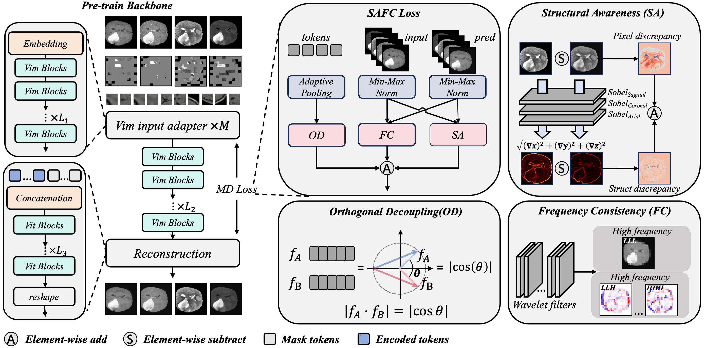
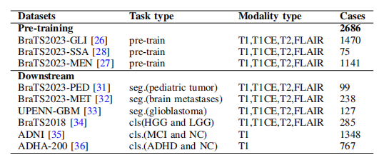

# DiscrepMamba 

This work introduces DiscrepMamba, a consecutive encoding by self-supervised learning with Mamba plus modality discrepancy Loss for brain MRI.

We achieve state-of-the-art performance on 9 open-source segmentation and classification tasks. Feel free to use it to adapt to your own tasks!


## Abstract
Self-supervised learning (SSL) reduces the annotation cost by generating pseudo labels or supervisory signals which uses these labels to train the model. It always uses a small-scale dataset in the downstream tasks fine-tuning likes medical image processing including brain magnetic resonance imaging (MRI), since SSL could significantly improve the amount of medical images requirements. However, for brain MRI, which is essential for diagnosing most neural system and soft tissue pathological changes, existing works have not fully analyzed the relationships between different modalities, but merely treated them as prior knowledge. To this end, A consecutive encoding by SSL with Mamba plus modality discrepancy loss strategy named DiscrepMamba is proposed in this study to confront the situation of similarities and differences coexist in brain MRI processing. Specifically, DiscrepMamba first conducts a systematic data analysis of multimodal brain MRI. Based on the findings, a two-stage encoding strategy is proposed to preserve modality independence and inter-modal complementarity. Then, a Structure-Aware Frequency Consistency (SAFC) loss is incorporated to protect the complex relationships between different modalities. To prove the effectiveness of DiscrepMamba, extensive experiments have been conducted on six datasets in two downstream tasks including segmentation and classification. Compared with the state-of-the-art works, DiscrepMamba has achievedsuperior performance on three segmentation tasks, including the Dice score increased by 1.09\%-7.99\%; in three classification tasks, the accuracy increased by 0.33\%-2.06\%.


## Datasets


All downstream datasets are open-source.
## Get Started

**Installation**
```bash
conda create -n discrepmamba python=3.10.13
conda activate discrepmamba
pip install -r requirements.txt
```

**Pre-train**
```bash 
bash train.sh
```
**Finetune**

We provide example code for fine-tuning on the BraTS-GLI dataset in the scripts folder, which you can modify to suit your own task.
```bash 
# finetune
bash fine_tuning_classify.sh
# evaluate
bash evaluate_classify.sh
```

## 🙏 Acknowledgement

A lot of code is modified from [MultiMAE](https://github.com/EPFL-VILAB/MultiMAE).


## 📝 Citation

If you find this repository useful, please consider citing this paper:
```
@unpublished{discrepmamba,
  title   = {Beyond Priors: A Consecutive Encoding by Self-Supervised Learning with Mamba plus Modality Discrepancy Loss for Brain MRI},
  author  = {Yumeng Jia and Cong Shen and Haifeng Wang and Shengyong Chen and Shiqiang Mang},
  note    = {submitted for publication},
  year    = {2026}
}
```
